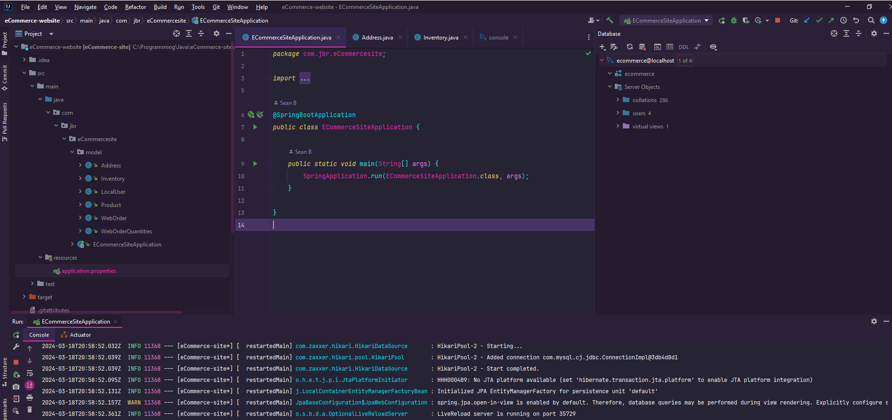
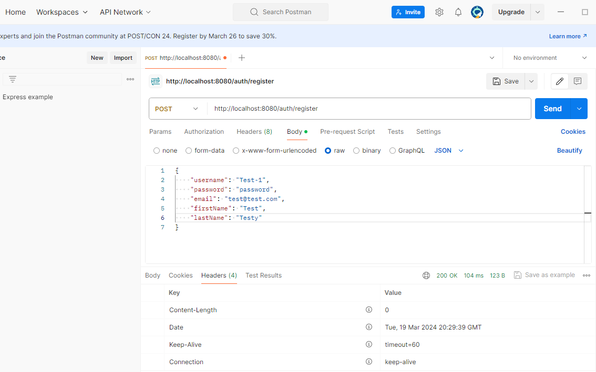

# eCommerce-website
 
eCommerce site built to properly test out Spring Boot for working on mainly backend of a website

Built using Java 17, Spring Boot 3.2.3, Hibernate, SQL Server, and testing with Postman

Some assistance from: https://www.youtube.com/watch?v=AYCRR70gH3w&list=PLtBt-olBU9cTm-5SdTy3mjaSEnHglK-Mz&index=2

Also found useful information about adding dependencies using Maven on start.spring.io

*******
resources/application.properties -> add info for connecting to SQL database
*******

Driver problem resolved using: https://stackoverflow.com/questions/33123985/cannot-load-driver-class-com-mysql-jdbc-driver-spring

https://www.reddit.com/r/SpringBoot/comments/1b16juw/unable_to_run_spring_boot/

https://spring.io/guides/gs/accessing-data-mysql

Currently stopped here: https://www.youtube.com/watch?v=QWk-cq48ZAY&list=PLtBt-olBU9cTm-5SdTy3mjaSEnHglK-Mz&index=4

Interesting to apply the use of Java maps to store key-value pairs for inserting and deleting from SQL:
https://www.geeksforgeeks.org/map-interface-java-examples/

Error with data sources resolved with: https://stackoverflow.com/questions/14356148/intellij-idea-specify-datasource-for-jpa-validation

Good information on websockets: https://www.baeldung.com/java-websockets

Can now send class objects to the registration authorisation endpoint for posting requests to register users

Good info on interfaces: https://www.geeksforgeeks.org/interfaces-in-java/

Beginning to understand the use of the DAO to separate the business logic (registering) from the actual data its using (the user info)

Good article on JSON web tokens use in Java: https://cheatsheetseries.owasp.org/cheatsheets/JSON_Web_Token_for_Java_Cheat_Sheet.html
And here: https://www.loginradius.com/blog/engineering/cookie-based-vs-cookieless-authentication/

For help with solving the default password issue Spring was producing: https://docs.spring.io/spring-boot/docs/current/reference/html/web.html

